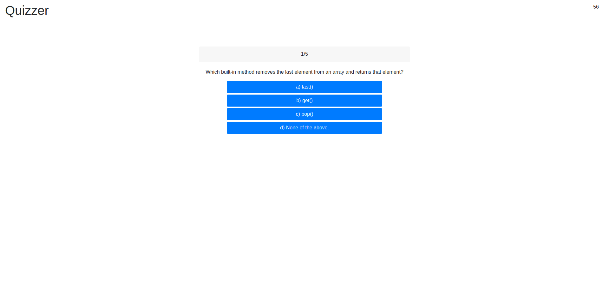

# Quizzer

This is a quiz application that tests users on their JavaScript knowledge. They are given 60 seconds to complete a quiz of 5 questions. For every question they answer incorrectly, they will loose 5 seconds. For every question they answer correctly, they will get one point. The quiz is over either when the user answers all the questions or run out of time. They will then be prompted to enter their initials, and their high score will be saved in local storage.  

application link: https://maplesyrupman.github.io/quizzer/ 
github repo: https://github.com/maplesyrupman/quizzer/

